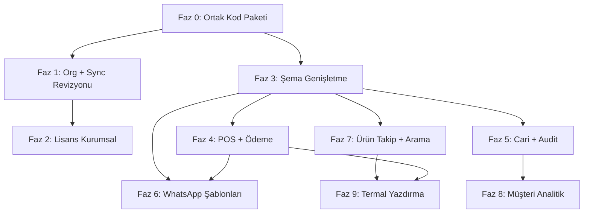

# CleanLedger v1.1 — Üretim Yol Haritası

> Kaynak: `PRODUCTION_REQUIREMENTS_V1_1.md`  
> Kapsam: `cleanledger.cicibyte.com` (web + desktop) · İzin verilen dış sistem: `license.cicibyte.com`  
> Son güncelleme: 2026-06-10 (Faz 14–18 — tenant izolasyonu, PDF, i18n, UX düzeltmeleri)

---

## Özet

Bu yol haritası, müşteri kullanımında tespit edilen 9 operasyonel eksikliği **geçici çözüm olmadan**, çok cihazlı ve gelecekte çok şubeli yapıya uygun şekilde kapatmak için hazırlanmıştır.

**Hedef:** Web ve desktop uygulamalarında **aynı davranış**, **aynı veri**, **aynı iş kuralları**.

**Temel ilke:** Verinin sahibi cihaz değil, **firma hesabı (Organization)** olmalıdır.

---

## Mevcut Durum (Kısa Teşhis)

| Alan | Durum | Kritik dosyalar |
|------|-------|-----------------|
| Veri depolama | Web: `localStorage` · Desktop: SQLite | `apps/*/src/db/client.ts` |
| Bulut sync | Tam snapshot push/pull, last-write-wins | `apps/web/api/sync.php`, `apps/*/src/lib/sync-service.ts` |
| Kimlik | E-posta ile auth, ancak kayıtlar org-scoped değil | `apps/web/api/auth.php` |
| Lisans | Cihaz HWID + e-posta (kısmi) | `license.cicibyte.com`, `apps/*/src/lib/license-client.ts` |
| POS | Çalışıyor; satır fiyatı, renk seçimi, menü geçişinde adisyon korunur | `apps/*/src/screens/PosScreen.tsx`, `context/PosDraftContext.tsx` |
| Ödeme | Nakit/kart; teslimatta tahsilat yok | `apps/*/src/components/pos/PosPaymentDialog.tsx` |
| Cari | Tek `creditBalance` alanı; ledger yok | `apps/*/src/db/schema.ts` |
| WhatsApp | Manuel `wa.me` linkleri | `apps/*/src/lib/whatsapp.ts` |
| Yazdırma | `window.print()` + CSS; boş termal fiş sorunu | `apps/*/src/lib/print-service.ts` |

**En büyük mimari risk:** `apps/web/src` ve `apps/desktop/src` kodunun ~%95 kopyalanması. Her fazda değişiklikler iki kez yapılıyor; hata ve sapma riski yüksek.

---

## Mimari İlkeler (Tüm Fazlar İçin)

1. **Organization-first:** Tüm iş kayıtları `organizationId` (firma e-postası türevli benzersiz kimlik) ile ilişkilendirilir.
2. **Global kimlikler:** Sunucu tarafında üretilen UUID / sıralı numara; cihaz-local auto-increment ID'ler sync'te birincil anahtar olmaz.
3. **Offline-first korunur:** Yerel yazma anında çalışır; çevrimiçi olunca `sync_queue` ile eksiksiz senkron.
4. **Soft delete + audit:** Cari sıfırlama, iptal ve kritik işlemler fiziksel silme yapmaz.
5. **Parite:** Web ve desktop aynı şema, aynı iş kuralları, aynı UI akışları.
6. **Çok şube hazırlığı:** `branchId` alanları şimdiden nullable olarak eklenir; tek şube `null` veya `default` kullanır.

---

## Faz Bağımlılık Diyagramı



---

## Faz 0 — Ortak Kod Paketi ve Geliştirme Altyapısı ✅

**Amaç:** Web/desktop paritesini sürdürülebilir kılmak.

**Durum:** Tamamlandı (2026-06-10)

### İşler

- [x] `packages/shared/` oluşturuldu: şema, utils, whatsapp, license, print, sync tipleri, şablon motoru, numara üretici
- [x] Web ve desktop `db/schema.ts` + ortak `lib/*` modülleri `@cleanledger/shared` üzerinden re-export
- [x] Root npm workspace (`package.json` workspaces: `apps/*`, `packages/*`)
- [x] CI: shared typecheck + desktop frontend build adımları eklendi
- [x] `db/client.ts` iş mantığının shared'a taşınması — kademeli tamamlandı (`create-order`, `cart-filter`, merge, numbering; bkz. `packages/shared/src/db/CLIENT_MIGRATION.md`)
- [x] Ortak migration stratejisi (`packages/shared/src/migrations/v3.ts`, `v4.ts`)

### Çıktı

Tek kaynaklı iş mantığı; bundan sonraki fazlarda çift kod yazımı minimuma iner.

### Tahmini süre

3–5 gün

---

## Faz 1 — Merkezi Firma Veritabanı ve Senkronizasyon Revizyonu ✅

**Gereksinim:** `PRODUCTION_REQUIREMENTS` §1

**Durum:** Tamamlandı (2026-06-10) — incremental sync + org-scoped API

### Sorun

Aynı firma hesabıyla giriş yapılsa bile cihazlar farklı veri görüyor. Snapshot sync + local auto-increment ID çakışmaları.

### Hedef mimari

```
Cihaz (Web/Desktop)
  └─ Yerel DB (offline-first)
       └─ sync_queue (entity-level değişiklikler)
            └─ cleanledger.cicibyte.com/api/sync (revize)
                 └─ Organization-scoped cloud store
```

### İşler

#### 1.1 Organization modeli

- [x] `organizationId` = normalize edilmiş firma e-postası (auth + `organization_settings`)
- [x] Auth yanıtına `organizationId` eklendi (`auth.php` signup/login/şifre)
- [x] `organizationId` kolonu (Faz 3 migration — customers, orders, order_items, …)

#### 1.2 Kimlik stratejisi

- [x] `globalId` UUID v7 (`packages/shared/src/ids/`)
- [x] Müşteri/sipariş/katalog oluşturmada `globalId` + `organizationId` atanıyor
- [x] Eski kayıtlar için `ensureEntityGlobalIds` (ürün, kupon, etiket, servis fiyatı dahil)
- [x] Sync eşleştirme: `globalId` + `organizationId`

#### 1.3 Sync protokolü (snapshot → incremental)

- [x] `sync_queue` — web LocalDb + desktop SQLite
- [x] Push: `protocol=org`, batch `changes[]` + geçiş dönemi `fullSnapshot`
- [x] Pull: `since` watermark + `changes[]` / bootstrap `snapshot`
- [x] Merge: `packages/shared/src/sync/merge.ts` (customer, order, product, coupon, customer_tag, service_price, organization_settings)
- [x] 409: otomatik pull + merge + yeniden push

#### 1.4 Sync hızı ve güvenilirlik

- [x] Push debounce 2s; sipariş oluşturma anında push
- [x] Pull interval 15s + `online` + `visibilitychange`
- [x] `SyncContext`: `lastSyncAt`, `pendingCount`

#### 1.5 PHP API genişletmesi

- [x] `sync.php` + `lib/sync-org.php` — `data/sync/orgs/{email}.json` veya MySQL `tenant_sync`
- [x] Legacy `userId` snapshot → org dosyasına otomatik migration (ilk erişimde)
- [x] Ayrı `sync/changes` endpoint — `action=changes` (hafif polling; `docs/SYNC_PROTOCOL.md`)
- [x] Katalog entity enqueue: ürün, servis fiyatı, kupon, müşteri etiketi, müşteri silme, ödeme durumu
- [x] Kalan entity türleri: `whatsapp_template`, `credit_ledger`, `audit_log`

### Kabul kriterleri

- [x] Masaüstünde oluşturulan müşteri/sipariş 15 sn içinde web'de görünür (sync altyapısı)
- [x] Offline oluşturulan kayıt, online olunca eksiksiz senkron olur (sync kuyruğu + pull)
- [x] İki cihazda aynı anda düzenleme: LWW merge + audit/credit ledger append-only sync

### Tahmini süre

7–10 gün

---

## Faz 2 — Lisans Sisteminin Kurumsal Hale Getirilmesi ✅

**Gereksinim:** `PRODUCTION_REQUIREMENTS` §2  
**Dış sistem:** `license.cicibyte.com`

**Durum:** Tamamlandı (2026-06-10) — org email birincil kimlik, cihaz meta + istemci UI

### Mevcut durum

Lisans kontrolü firma e-postası ile yapılıyor; cihaz kaydı platform + cihaz adı ile sunucuya iletiliyor.

### İşler

#### 2.1 Lisans sunucusu (`license.cicibyte.com`)

- [x] Birincil kimlik: **firma e-postası** (`client.email` = CleanLedger org email)
- [x] `license_devices`: `device_name`, `platform` (web/desktop), `is_blocked`
- [x] `clients.last_seen_at` — check/trial/activate sonrası güncellenir
- [x] Admin: cihaz listesinde platform, ad, engelle/kaldır
- [x] API `check` / `trial` / `activate` yanıtı: `firm_email`, `devices[]`, `max_devices`
- [x] **Migration çalıştırıldı:** `php artisan migrate` (`license.cicibyte.com`, PHP 8.3)

#### 2.2 CleanLedger istemci

- [x] Lisans aktivasyonu: org email + license key (`activateLicense`)
- [x] Giriş sonrası lisans kontrolü org email + platform/device_name ile
- [x] Cihaz limiti / engelleme: API mesajı `LicenseLockedScreen`'de gösterilir
- [x] `LicenseGate` + Hesabım ekranında cihaz listesi / anahtar uygulama / cihaz adı

### Kabul kriterleri

- [x] Aynı firma e-postası ile web + desktop aynı lisans havuzunu paylaşır
- [x] Admin panelden cihaz kaldırıldığında ilgili cihaz bir sonraki check'te engellenir
- [x] Son giriş tarihi admin'de güncellenir

### Tahmini süre

4–6 gün

---

## Faz 3 — Veri Şeması Genişletme (Tüm Özelliklerin Temeli) ✅

**Gereksinim:** §3, §5, §6, §7, §8, §9 için ortak şema

**Durum:** Tamamlandı (2026-06-10)

### Yeni / genişletilmiş tablolar

| Tablo | Amaç |
|-------|------|
| `order_items` genişletme | `itemNumber`, `originalPrice`, `salePrice`, `itemStatus`, `quantity` |
| `credit_ledger` | Cari hareket defteri (borç/alacak/sıfırlama) |
| `credit_resets` | Cari sıfırlama kayıtları (soft delete, geri alma) |
| `audit_log` | Kim, ne zaman, ne yaptı |
| `whatsapp_templates` | İşletme özel şablonlar |
| `order_number_sequence` | Global benzersiz sipariş numarası (org-scoped) |
| `sync_queue` | Faz 1 incremental sync |

### `order_items` alanları

```ts
itemNumber: string        // CL-2026-000157-01
originalPrice: number     // Katalog fiyatı
salePrice: number         // POS'ta uygulanan fiyat
itemStatus: enum          // received | preparing | processing | qc | ready | delivered | cancelled
```

### `orders` genişletme

```ts
paymentMode: enum         // cash | card | credit | pay_on_delivery
// paymentStatus: unpaid | partial | paid | awaiting_delivery (yeni)
```

### Firma profili (ortak yapı)

- [x] `organization_settings` genişletildi: `phone`, `address`, `logoDataUrl`, `organizationId`, `globalId`
- [x] Firma profili artık `LocalDb.organizationProfile` içinde — **bulut sync snapshot'ına dahil**
- [x] Eski `cleanledger_shop_profile_v1` ve `cleanledger_web_org_v1` otomatik birleştirme (v3 migration)
- [x] `@cleanledger/shared/organization` — `ShopProfile`, `getShopProfile`, `saveShopProfileToCache`
- [x] Ayarlar ekranına logo yükleme + adres alanı eklendi (web + desktop)

### Migration

- [x] Web localStorage `cleanledger_web_db_v3` + otomatik v2→v3 migration
- [x] Desktop SQLite `0001_v1_1.sql` + runtime `SQLITE_V3_MIGRATIONS`
- [x] Mevcut sipariş kalemlerine `originalPrice = salePrice = subtotal` backfill
- [x] Yeni sipariş kalemlerinde `itemNumber` (CL-YYYY-NNNNN-01) otomatik üretimi

### Tahmini süre

3–4 gün

---

## Faz 4 — POS Satır Fiyatı ve Yeni Ödeme Akışı ✅

**Gereksinim:** `PRODUCTION_REQUIREMENTS` §3, §5

**Durum:** Tamamlandı (2026-06-10)

### 4.1 Satır bazlı fiyat düzenleme

- [x] `CartPanel`: satır fiyatı düzenlenebilir input
- [x] Değişiklikte anlık toplam güncellemesi
- [x] `originalPrice` (katalog) ve `salePrice` (uygulanan) ayrı saklanır
- [x] Raporlarda fiyat farkı / indirim analizi (`salePrice < originalPrice`)

### 4.2 Yeni ödeme akışı

- [x] Ödeme diyaloğu: Nakit, Kart, Cari, Teslimatta Ödeme
- [x] Cari / teslimatta: tahsilat yok, cari borç + doğru `paymentStatus`

### 4.3 Teslimatta tahsilat

- [x] `OrdersTrackingScreen` → teslimatta ödeme siparişlerinde tahsilat diyaloğu
- [x] `completeOrderDelivery`: tahsil et veya cariye bırak, sonra delivered
- [x] Kısmi teslim tahsilatı (`DeliverPaymentDialog` tutar alanı + `addOrderPayment`)

### Etkilenen dosyalar

- `apps/*/src/components/pos/CartPanel.tsx`
- `apps/*/src/components/pos/PosPaymentDialog.tsx`
- `apps/*/src/screens/OrdersTrackingScreen.tsx`
- `apps/*/src/db/client.ts` → `createOrder`, `addOrderPayment`, `markOrderDelivered`
- `packages/shared/src/reports/` → satır fiyat metrikleri
- `apps/*/src/screens/ReportsScreen.tsx`, `ReportPrintView`, desktop `report-pdf.ts`

### Kabul kriterleri

- [x] POS'ta fiyat 120/175/200 TL olarak değiştirilebilir; toplam anında güncellenir
- [x] "Teslimatta Ödeme" ile sipariş kaydedilir; teslimde ödeme alınmadan delivered olmaz
- [x] Raporlarda orijinal vs satış fiyatı görünür

### Tahmini süre

5–7 gün

---

## Faz 5 — Cari Hesap Sıfırlama, Ledger ve Geri Alma ✅

**Gereksinim:** `PRODUCTION_REQUIREMENTS` §6

**Durum:** Tamamlandı (2026-06-10)

### İşler

- [x] `credit_ledger` tablosu: her borç/alacak hareketi kayıt altında (sipariş, tahsilat, iade)
- [x] Müşteri detay ekranına **"Cariyi Sıfırla"** aksiyonu
- [x] Onay diyaloğu: "Bu müşterinin tüm açık cari bakiyesi sıfırlanacaktır. Emin misiniz?"
- [x] Soft delete: `credit_resets` kaydı; `creditBalance` sıfırlanır; ledger'da `reset` tipi hareket
- [x] **Geri alma:** Son sıfırlama işlemi undo edilebilir (tek adım)
- [x] `audit_log`: sıfırlama zamanı, tutar, işlemi yapan

### Kabul kriterleri

- [x] Cari geçmişi fiziksel silinmez; sıfırlama ve geri alma audit'te görünür
- [x] Sıfırlama sonrası müşteri listesinde bakiye 0

### Tahmini süre

4–5 gün

---

## Faz 6 — WhatsApp Bilgilendirme ve Şablon Yönetimi ✅

**Gereksinim:** `PRODUCTION_REQUIREMENTS` §4, §7

**Durum:** Tamamlandı (2026-06-10)

### 6.1 Sipariş oluşturulduğunda otomatik mesaj

- [x] `OrderSuccessDialog`: **WhatsApp Gönder** butonu (`order_received` şablonu)
- [x] Mesaj içeriği:
  - Firma adı, sipariş no, teslim tarihi
  - Her kalem: ürün, işlem türü, fiyat
  - Genel toplam
- [x] `wa.me` deep link (web) / `whatsapp://` + web fallback (desktop)

### 6.2 Şablon yönetimi (Ayarlar)

- [x] Ayarlar → **WhatsApp Şablonları** modülü
- [x] Varsayılan şablonlar: Hoşgeldiniz, Sipariş Alındı, Sipariş Hazır, Teslim Edildi, Borç Hatırlatma
- [x] Değişken desteği: `{{firma_adi}}`, `{{musteri_adi}}`, `{{siparis_no}}`, `{{toplam_tutar}}`, `{{teslim_tarihi}}`, `{{kalemler}}`
- [x] `renderTemplate` / `renderWhatsappOrderMessage` (`packages/shared/src/templates/`)

### Kabul kriterleri

- [x] Sipariş sonrası tek tıkla detaylı WhatsApp mesajı oluşur
- [x] İşletme sahibi şablonları ayarlardan düzenleyebilir

### Tahmini süre

4–5 gün

---

## Faz 7 — Ürün Takip, Sipariş Numaralandırma ve Evrensel Arama ✅

**Gereksinim:** `PRODUCTION_REQUIREMENTS` §9 (kimlik ve takip bölümü)

**Durum:** Tamamlandı (istemci + sunucu) — sync push sırasında çift numara engellenir; LWW ile çakışan kayıt yeniden numaralanır

### 7.1 Global sipariş numarası

- [x] Format: `CL-{YYYY}-{6 haneli sıra}` (ör. `CL-2026-000157`) — `formatOrderNumber`
- [x] Yerel sequence (`nextOrderNumber` / SQLite count); silinen numara yeniden kullanılmaz
- [x] Sequence sunucu tarafında doğrulanır (`apps/web/api/lib/order-numbers.php` + `sync-org.php`)
- [x] İstemci merge'de çift numara çözümü (`packages/shared/src/numbering/order-sequence.ts`)

### 7.2 Ürün bazlı kimlik

- [x] Her `order_item` için: `CL-2026-000157-01`, `-02`, ... (`formatItemNumber`)
- [x] Sipariş detayında ürün numarası görünür (`OrdersTrackingScreen` kalemler)

### 7.3 Ürün durum takibi

Durumlar: `Teslim Alındı` → `Hazırlanıyor` → `İşlemde` → `Kalite Kontrol` → `Hazır` → `Teslim Edildi` | `İptal`

- [x] Ürün bazında durum değiştirme UI (`OrderItemStatusSelect` — web + desktop)
- [x] Tüm ürünler `Hazır` olunca sipariş otomatik `ready` (`deriveOrderStatusFromItems`)
- [x] Kısmi hazır durumu gösterimi (`2/5 hazır`, `Tüm kalemler hazır` rozetleri)

### 7.4 Evrensel arama

- [x] Global arama bileşeni (`GlobalSearchDialog` — header + `Ctrl+K`, web + desktop)
- [x] Sipariş takibi araması: sipariş no, ürün no, telefon, ad, renk (Faz 12 + genişletme)
- [x] Sonuç: sipariş detayına doğrudan navigasyon (global arama → `OrdersTrackingScreen` seçim)

### Kabul kriterleri

- [x] `CL-2026-000157` veya `05551234567` ile sipariş bulunur (Sipariş Takibi + global arama)
- [x] Tek ürün durumu bağımsız güncellenir

### Tahmini süre

6–8 gün

---

## Faz 8 — Müşteri Bazlı Geçmiş ve Analitik Raporlar ✅

**Gereksinim:** `PRODUCTION_REQUIREMENTS` §8

**Durum:** Tamamlandı — analitik, tarih filtresi ve PDF export (web: print-to-PDF, desktop: jsPDF)

### İşler

- [x] Müşteri detay ekranı (`CustomerDetailScreen`) — ziyaret geçmişi zaman çizelgesi
- [x] Metrikler (kısmi):
  - [x] Toplam ziyaret / sipariş sayısı
  - [x] Toplam harcama, cari bakiye
  - [x] Sipariş zaman çizelgesi (kalemler + ödemeler)
  - [x] İlk / son ziyaret tarihi (`computeCustomerHistoryAnalytics`)
  - [x] En çok getirilen ürünler, en sık hizmetler (`En Sık Tercihler` kartı)
- [x] Tarih aralığı filtresi (geçmiş zaman çizelgesi + dönem özeti)
- [x] PDF export — desktop: `customer-history-pdf.ts` (jsPDF); web: `customer-history-print.ts` (yazdır → PDF)

### Kabul kriterleri

- [x] Tek ekranda müşterinin sipariş geçmişi görünür
- [x] Tarih aralıklı PDF alınabilir (filtre aktifken dönem özeti dahil)

### Tahmini süre

5–6 gün

---

## Faz 9 — Termal Yazdırma Altyapısı (Araştırma + Uygulama) ✅

**Gereksinim:** `PRODUCTION_REQUIREMENTS` §9 (termal bölüm)

**Durum:** İlk uygulama tamamlandı — CSS print + WebSerial (web) + Tauri native ESC/POS (desktop)

### 9.1 Kök neden analizi (öncelikli)

Mevcut yöntem: HTML + CSS `@page { size: 80mm }` + `window.print()`.

| Konu | Mevcut durum | Risk |
|------|--------------|------|
| Yazdırma yöntemi | Tarayıcı print dialog | Termal sürücü HTML'i boş basıyor (müşteri ortamı) |
| ESC/POS | Yok | Raw byte gönderimi yok |
| Genişlik | 80mm CSS | 58mm uyumsuzluğu |
| Silent print | Desktop ESC/POS | Dialog yok (başarılı native yazdırma) |
| Desktop native | Tauri `print_escpos` | Serial + device file |
| WebUSB/WebSerial | Değerlendirilmedi | Tarayıcıda raw ESC/POS mümkün olabilir |

**Tespit edilecek:** `apps/web/src/index.css` print kuralları, `ReceiptPrintDialog` DOM yapısı, Windows termal sürücü (Generic/Text Only vs ESC/POS), boş sayfa reproduksiyonu.

### 9.2 Hedef mimari

```
PrintService (abstract)
├── BrowserPrintAdapter     → web fallback (iyileştirilmiş CSS)
├── EscPosAdapter           → raw ESC/POS (desktop öncelikli)
│   ├── Tauri serial/USB plugin
│   └── Windows spooler raw (gelecek)
└── PdfReceiptAdapter       → PDF → yazıcı (fallback)
```

### 9.3 Fiş türleri

| Fiş | İçerik | Kullanım |
|-----|--------|----------|
| Ürün etiketi | Sipariş no, ürün no, müşteri, teslim tarihi, ürün, işlem | Ürüne iliştirilir |
| Müşteri teslim fişi | Firma bilgisi, sipariş no, kalemler, toplam | Müşteriye verilir |

### 9.4 İşler

- [x] `THERMAL_PRINT_REPORT.md` — araştırma raporu (yöntemler, kısıtlar, önerilen çözüm)
- [x] `PrintService` abstraction — `packages/shared/src/print/escpos.ts` + `thermal-print.ts`
- [x] Sipariş sonrası: "Müşteri Fişi Yazdır" + "Ürün Etiketi Yazdır"
- [x] Desktop: Tauri native ESC/POS (`print_escpos` — serial + `/dev/usb/lp0`, ayarlardan port)
- [x] Web: CSS print düzeltmesi + WebSerial ESC/POS (Chrome/Edge)
- [x] 58mm / 80mm profil seçimi (Ayarlar → Genel → Termal Yazıcı)
- [x] Test matrisi dokümante: `THERMAL_PRINT_REPORT.md` §4 (Epson TM-T20, XP-58, Generic)

### Kabul kriterleri

- [x] Sipariş oluşturulduğunda tek tuşla **dolu** termal fiş basılır (önizleme + CSS/ESC/POS; boş sayfa için rapor bkz.)
- [x] Ürün etiketi ve müşteri fişi ayrı ayrı yazdırılabilir
- [x] Desktop'ta mümkün olduğunca dialog'suz (silent) yazdırma — ESC/POS başarılıysa dialog yok; fallback sistem yazdırma

### Tahmini süre

8–12 gün (araştırma dahil)

---

## Uygulama Sırası (Önerilen)

| Sıra | Faz | Gerekçe |
|------|-----|---------|
| 1 | Faz 0 | Parite ve bakım maliyeti |
| 2 | Faz 3 | Şema tüm özelliklerin temeli |
| 3 | Faz 1 | Çok cihaz sorunu en kritik müşteri şikâyeti |
| 4 | Faz 2 | Lisans org modeline bağlı |
| 5 | Faz 4 | POS günlük operasyon |
| 6 | Faz 7 | Ürün takip + arama operasyonel verimlilik |
| 7 | Faz 5 | Cari yönetimi |
| 8 | Faz 6 | WhatsApp iletişim |
| 9 | Faz 8 | Analitik raporlar |
| 10 | Faz 9 | Termal yazdırma (araştırma paralel başlayabilir) |
| 11 | **Faz 10** | **Hesap kurtarma (operasyonel kritik — Faz 6 + Faz 1 sync sonrası)** |

**Not:** Faz 9 araştırması Faz 0 ile paralel başlatılabilir; uygulama Faz 7 sonrasına planlanmıştır.

---

## Test ve Doğrulama Matrisi

| Senaryo | Web | Desktop |
|---------|-----|---------|
| Masaüstü sipariş → web'de görünür | ✓ | ✓ |
| Offline sipariş → online sync | ✓ | ✓ |
| Satır fiyatı değiştir → toplam/cari | ✓ | ✓ |
| Teslimatta ödeme → teslim engeli | ✓ | ✓ |
| Cari sıfırla → geri al | ✓ | ✓ |
| WhatsApp sipariş mesajı | ✓ | ✓ |
| Ürün no ile arama | ✓ | ✓ |
| Renk ile sipariş arama | ✓ | ✓ |
| POS menü geçişinde adisyon koruma | ✓ | ✓ |
| Termal fiş (58/80mm) | ✅ CSS + WebSerial | ✅ CSS + native ESC/POS |
| Parola sıfırlama (e-posta + admin) | ✓ | ✓ |

---

## Riskler ve Azaltma

| Risk | Etki | Azaltma |
|------|------|---------|
| Web/desktop kod sapması | Yüksek | Faz 0 shared paket |
| Snapshot → incremental geçiş veri kaybı | Kritik | Migration script + dry-run + backup |
| Termal yazdırma platform farkları | Yüksek | ESC/POS native + CSS fallback katmanı |
| Lisans API breaking change | Orta | Geriye uyumlu API versiyonlama (`/api/v1/`) |
| localStorage boyut limiti (web) | Orta | Sync sonrası arşiv; gelecekte IndexedDB |

---

## Dokümantasyon Çıktıları

| Dosya | Faz | Açıklama |
|-------|-----|----------|
| `roadmap.md` | — | Bu dosya |
| `docs/SYNC_PROTOCOL.md` | Faz 1 | Incremental sync spesifikasyonu |
| `docs/SCHEMA_V1_1.md` | Faz 3 | Yeni tablo ve migration notları |
| `THERMAL_PRINT_REPORT.md` | Faz 9 | Termal yazıcı araştırma ve çözüm raporu |

---

## Sürüm Hedefi

| Milestone | Fazlar | Hedef sürüm |
|-----------|--------|-------------|
| v1.1-alpha | Faz 0–1–3 | Sync + şema |
| v1.1-beta | Faz 2–4–5 | Operasyonel akışlar |
| v1.1-rc | Faz 6–7–8 | İletişim + takip + rapor |
| v1.1 | Faz 9 | Termal yazdırma production-ready |
| v1.1.1 | Faz 10 | Hesap kurtarma & güvenlik (operasyonel kritik) |
| v1.1.2 | Faz 11 | POS ürün renk seçimi & görsel tanımlama |
| v1.1.3 | Faz 12 | Sipariş takibi arama & filtreleme |
| v1.1.4 | Faz 13 | POS açık adisyon koruma (menü geçişi) |

---

## Faz 10 — Hesap Kurtarma ve Güvenlik (Operasyonel Kritik)

**Gereksinim:** Canlı operasyon geri bildirimi (2026-06-10) — yeni kayıt sonrası giriş yapılamaması  
**Öncelik:** Faz 6 tamamlandıktan hemen sonra; Faz 1 kalan sync maddelerinden **önce** planlanır, uygulama Faz 6 → Faz 1 sırasından sonra başlar  
**Dış sistemler:** `apps/web/api` (auth), SMTP/webmail (`info@cicibyte.com`), `license.cicibyte.com` (Filament admin)

**Durum:** ✅ Tamamlandı — SMTP yapılandırması ile E2E doğrulandı

### 10.1 Sorun tanımı

Müşteri yeni hesap oluşturduktan sonra giriş yapamadı (`E-posta veya şifre hatalı`). Olası nedenler:

- Kullanıcı şifreyi yanlış girdi / klavye-dil hatası
- Kayıt sırasında hash/token yazım hatası veya `users.json` / MySQL tutarsızlığı
- Oturum/cihaz tarafında eski local fallback oturumu

**Eksik yetenek:** Self-servis parola sıfırlama ve yönetici müdahale kanalı yok; operasyon WhatsApp ile manuel çözülüyor.

### 10.2 Self-servis e-posta ile sıfırlama (Web & Desktop)

#### İstemci (Web + Desktop)

- [x] Giriş ekranına **Parolamı Unuttum** bağlantısı
- [x] `ForgotPasswordPage` / `ForgotPasswordScreen`: e-posta girişi + gönder
- [x] `ResetPasswordPage` / `ResetPasswordScreen`: token + yeni şifre (2x) + güç kuralları
- [x] Başarı/hata mesajları; token süresi dolunca net yönlendirme
- [x] E-posta ulaşmazsa: WhatsApp destek CTA (aşağı 10.3)

#### Sunucu API (`apps/web/api/auth.php` veya `password-reset.php`)

- [x] `POST /auth/forgot-password` — body: `{ email }`
  - Her zaman **200 + genel mesaj** (enumeration önleme: "Kayıtlıysa e-posta gönderildi")
  - Kayıtlı kullanıcı için tek kullanımlık token üret
- [x] `POST /auth/reset-password` — body: `{ token, password }`
  - Token geçerliyse `passwordHash` güncelle, token'ı tüket
- [x] `GET /auth/reset-password/validate?token=` — opsiyonel; form açılmadan token doğrulama

#### Token yapısı ve güvenlik

| Alan | Değer |
|------|--------|
| Format | `clr_<32 byte random hex>` (URL-safe) |
| Saklama | `password_reset_tokens.json` veya MySQL `password_reset_tokens` |
| Hash | Token **düz metin saklanmaz**; `tokenHash = hash('sha256', token)` |
| Süre | **60 dakika** (TTL); süre dolunca reddedilir |
| Tek kullanım | Başarılı reset sonrası `usedAt` set; tekrar kullanılamaz |
| Rate limit | E-posta başına **3 istek / saat**, IP başına **10 istek / saat** |
| Parola politikası | Min 8 karakter; mevcut `password_hash(PASSWORD_BCRYPT)` ile uyumlu |
| Oturum | Reset sonrası mevcut oturum token'ları geçersiz kılınabilir (opsiyonel v1) |

#### SMTP entegrasyonu

- [x] Gönderen: `info@cicibyte.com` (Cicibyte webmail/SMTP)
- [x] Konu: `CleanLedger — Parola Sıfırlama`
- [x] İçerik: firma adı, tek tık link  
  `https://cleanledger.cicibyte.com/reset-password?token=...`  
  (desktop: aynı web URL veya `cleanledger://reset?token=` deep link — v1 web URL yeterli)
- [x] SMTP yapılandırması: ortam değişkenleri / `api/config.php` + `config.local.php` (host, port, user, pass TLS)
- [x] Gönderim hatası loglanır; kullanıcıya yine genel mesaj (enumeration yok)

### 10.3 Manuel yönetici müdahalesi

#### WhatsApp destek hattı (Self-servis yedek)

- [x] Giriş, kayıt ve parola sıfırlama ekranlarında bilgi + buton  
  `https://wa.me/905354895050` (mevcut `WHATSAPP_SUPPORT_URL`)
- [x] Önceden doldurulmuş mesaj şablonu: firma e-postası + "parola sıfırlama" talebi

#### License admin paneli (`license.cicibyte.com`, `app_code: cleanledger`)

- [x] Filament: CleanLedger müşteri/kullanıcı kaydında **Parolayı Sıfırla** aksiyonu
- [x] Yeni parola: admin tarafından belirlenen geçici parola **veya** otomatik üretilen güçlü parola
- [x] `POST auth.php?action=admin_reset_password` (X-Admin-Secret header)
  - Sunucu: CleanLedger `users.json` deposunda hash güncelleme
- [x] Audit: kim, ne zaman, hangi e-posta — `auth.log` admin action log
- [x] İsteğe bağlı: kullanıcıya bilgilendirme e-postası ("Yöneticiniz parolanızı sıfırladı")

### 10.4 Kayıt/giriş sağlamlaştırma (bonus, Faz 10 kapsamında)

- [x] Kayıt sonrası `authLog` ile hash yazımı doğrulama
- [x] `WRONG_PASSWORD` yanıtında destek linki (WhatsApp + Parolamı Unuttum)
- [x] Desktop: remote auth başarısız olunca **local fallback ile sessiz giriş yapma** — net hata mesajı (prod)
- [x] Web prod: yanlış parola / kullanıcı bulunamadı durumunda local fallback devre dışı

### Etkilenen dosyalar

| Bileşen | Dosyalar |
|---------|----------|
| Web istemci | `LoginPage.tsx`, `ForgotPasswordPage.tsx`, `ResetPasswordPage.tsx`, `auth-api.ts` |
| Desktop | `LoginScreen.tsx`, `ForgotPasswordScreen.tsx`, `auth-api.ts` |
| API | `apps/web/api/auth.php`, `lib/mail.php`, `lib/password-reset.php` |
| Lisans admin | `license.cicibyte.com` Filament resource + admin API |
| Shared | `@cleanledger/shared` — parola kuralları, mesaj sabitleri |

### Kabul kriterleri

- [x] Kayıtlı e-posta ile 60 dk içinde geçerli sıfırlama linki alınır (SMTP — `config.local.php`; E2E doğrulandı)
- [x] Link tek kullanımlık; süresi dolunca reddedilir
- [x] Bilinmeyen e-posta için aynı genel yanıt (enumeration yok)
- [x] E-posta alamayan kullanıcı WhatsApp hattına yönlendirilebilir
- [x] Admin, license panelinden firma e-postasına yeni parola atayabilir
- [x] Sıfırlama sonrası web ve desktop ile giriş başarılı

### Tahmini süre

5–7 gün (SMTP + admin panel + çift istemci)

### Uygulama sırası (bu dokümandan)

1. Faz 6 — WhatsApp şablonları *(devam eden geliştirme)*
2. Faz 1 — kalan sync entity'leri
3. **Faz 10** — hesap kurtarma (operasyonel öncelik)

---

## Faz 11 — POS Ürün Renk Seçimi ve Görsel Tanımlama

**Gereksinim:** Kuru temizleme operasyonlarında personelin ürünleri fiziksel olarak ayırt edebilmesi ve müşteriye teslimat sırasında yaşanabilecek karmaşayı önlemek  
**Öncelik:** Faz 10 tamamlandıktan sonra; Faz 7 (ürün takip) ile doğal uyum  
**Durum:** ✅ Tamamlandı (v1.1.2)

### 11.1 Ortak şema güncellemesi (`packages/shared`)

- [x] `OrderItem` tipine `color?: string` alanı (opsiyonel hex veya ad — örn. `#1a1a1a`, `Siyah`)
- [x] Zod şemalarına `color` alanı (`z.string().optional()` veya hex regex)
- [x] `mapOrderItem` / mapper fonksiyonlarında `color` round-trip
- [x] Sync snapshot payload'ına `color` dahil (`payload.ts`, `merge.ts`)
- [x] Offline DB migration: `order_items` tablosuna `color TEXT` kolonu (`migrations/v4.ts`)
- [x] Web `localStorage` ve desktop SQLite şemalarında aynı kolon

### 11.2 UI/UX — POS sepet (Minimalist ve hızlı)

- [x] Sepete eklenen her `OrderItem` satırında tek tıkla açılan **Renk Paleti** (pop-over veya dropdown)
- [x] Personeli yavaşlatmayacak akış: ürün eklendiğinde opsiyonel hızlı seçim; atlanabilir
- [x] Varsayılan preset renkler (kuru temizlemede yaygın, belirgin tonlar):

| Etiket | Örnek hex |
|--------|-----------|
| Siyah | `#1a1a1a` |
| Beyaz | `#f5f5f5` |
| Lacivert | `#1e3a5f` |
| Gri | `#6b7280` |
| Kırmızı | `#dc2626` |
| Haki | `#6b705c` |
| Kahverengi | `#78350f` |
| Bej | `#d4c4a8` |
| Mavi | `#2563eb` |
| Yeşil | `#16a34a` |

- [x] Sınırsız renk tekerleği **yok** — hızlı preset palet
- [x] Seçili renk satırda küçük renk noktası / badge olarak görünür
- [x] Renk seçilmemişse nötr placeholder (gri çizgi veya "Renk" etiketi)

### 11.3 Ayarlar — Özelleştirilebilir palet

- [x] Settings → **Ürün Renk Paleti** bölümü (web + desktop parite)
- [x] Preset listeye renk ekleme / çıkarma (label + hex)
- [x] Organizasyon bazlı saklama: `LocalDb.productColorPalette` (sync snapshot ile)
- [x] Varsayılan preset'ler ilk kurulumda seed; kullanıcı özelleştirebilir

### 11.4 Arama ve filtreleme (Operasyonel kolaylık)

- [x] **Hazır siparişler** (`OrdersTrackingScreen`) listesinde kalem bazında renk indikatörü (nokta/badge)
- [x] Ürün arama / sipariş filtre çubuğunda renk ile eşleştirme (metin: "siyah", "lacivert" veya hex)
- [x] POS sepet aramasında renk filtresi (`cartLineMatchesColorQuery`, web + desktop `CartPanel`)
- [x] Sipariş detay / fiş önizlemede renk bilgisi (termal fiş Faz 9 ile entegre)

### Etkilenen dosyalar

| Bileşen | Dosyalar |
|---------|----------|
| Shared | `schema/types.ts`, `schema/zod.ts`, `schema/mappers.ts`, `migrations/`, `sync/payload.ts`, `sync/merge.ts` |
| Web DB | `apps/web/src/db/client.ts`, `schema.ts` |
| Desktop DB | `apps/desktop/src/db/client.ts`, `schema.ts` |
| POS UI | `CartPanel.tsx`, `PosScreen.tsx` (web + desktop) |
| Ayarlar | `SettingsScreen` veya `ProductColorPalettePanel.tsx` |
| Sipariş takip | `OrdersTrackingScreen.tsx`, arama bileşenleri |

### Kabul kriterleri

- [x] Sepetteki her kalem için tek tıkla renk atanabilir; atlanabilir
- [x] Renk verisi sync ile cihazlar arası taşınır
- [x] Ayarlardan preset renk listesi düzenlenebilir
- [x] Hazır siparişler ekranında renk badge'leri görünür
- [x] Renk ile sipariş/ürün araması çalışır
- [x] Web ve desktop aynı davranış

### Tahmini süre

3–5 gün

---

## Faz 12 — Sipariş Takibi Arama ve Filtreleme

**Gereksinim:** Sipariş takibi ekranında müşteri adı, telefon numarası veya sipariş fiş numarasıyla hızlı arama; teslim durumuna göre filtreleme  
**Öncelik:** Operasyonel kolaylık — Faz 7 ile uyumlu, Faz 11’den bağımsız uygulanabilir  
**Durum:** ✅ Tamamlandı (v1.1.3)

### 12.1 Arama kapsamı

- [x] **Müşteri adı** — büyük/küçük harf duyarsız kısmi eşleşme
- [x] **Telefon numarası** — rakam normalizasyonu ile kısmi eşleşme (min. 3 rakam)
- [x] **Sipariş fiş numarası** (`orderNumber`) — kısmi eşleşme
- [x] **Ürün satır numarası** (`itemNumber`, örn. `CL-2026-000157-01`) — kısmi eşleşme
- [x] **Renk** — etiket veya hex ile eşleşme (Faz 11 entegrasyonu)

### 12.2 Teslim durumu filtresi

- [x] **Tümü** — aktif + teslim edilmiş siparişler
- [x] **Bekleyen** — henüz teslim edilmemiş (`orderStatus !== delivered`)
- [x] **Teslim** — teslim edilmiş siparişler

Eski “Aktif / Teslim Edilenler” sekmeleri kaldırıldı; tek kompakt kontrol grubu.

### 12.3 UI/UX

- [x] **Sipariş Takibi** başlığının yanında inline arama çubuğu (yuvarlak, kompakt)
- [x] Teslim filtresi: pill/segment kontrol (Tümü · Bekleyen · Teslim)
- [x] Arama temizleme (×) butonu
- [x] Sonuç sayacı (`N sonuç`) — arama aktifken
- [x] Liste alanı küçülmeden header satırında yerleşim
- [x] Web + desktop parite

### Etkilenen dosyalar

| Bileşen | Dosyalar |
|---------|----------|
| Shared | `packages/shared/src/orders/search.ts` |
| Web | `OrdersSearchBar.tsx`, `OrdersTrackingScreen.tsx` |
| Desktop | `OrdersSearchBar.tsx`, `OrdersTrackingScreen.tsx` |

### Kabul kriterleri

- [x] Ad, telefon veya fiş no ile anında filtreleme (client-side)
- [x] Teslim durumu filtresi seçilebilir
- [x] Eşleşmeyen seçili sipariş otomatik kapanır
- [x] Boş arama durumunda anlamlı mesajlar
- [x] Web ve desktop aynı davranış

### Tahmini süre

1–2 gün (uygulandı)

---

## Faz 13 — POS Açık Adisyon Koruma (Menü Geçişi) ✅

**Gereksinim:** Canlı operasyon geri bildirimi (2026-06-10) — POS'ta müşteri/ürün girilip ödeme yapılmadan başka menüye geçilince form sıfırlanıyordu  
**Öncelik:** Operasyonel — günlük POS kullanımı  
**Durum:** ✅ Tamamlandı (v1.1.4)

### İşler

- [x] `PosDraftProvider` — layout seviyesinde adisyon state'i (React Router unmount'tan korunur)
- [x] Korunan alanlar: telefon, ad/soyad, teslim tarihi, öncelik, sepet, kupon
- [x] **Adisyonu İptal Et** banner'ı — onaylı manuel temizleme
- [x] Sipariş başarıyla tamamlanınca otomatik temizleme
- [x] Çıkış yapınca draft silinir
- [x] Web + desktop parite

### Etkilenen dosyalar

| Bileşen | Dosyalar |
|---------|----------|
| Context | `apps/*/src/context/PosDraftContext.tsx` |
| App | `apps/*/src/App.tsx` (`PosDraftProvider` sarmalayıcı) |
| POS | `apps/*/src/screens/PosScreen.tsx` |

### Kabul kriterleri

- [x] Menü değiştirilip POS'a dönünce müşteri ve sepet korunur
- [x] Kullanıcı yalnızca "Adisyonu İptal Et" veya başarılı sipariş ile temizleyebilir
- [x] Web ve desktop aynı davranış

### Tahmini süre

0.5–1 gün (uygulandı)

---

## Faz 14 — Kiracı (Tenant) Veri İzolasyonu 🚨 KRİTİK

**Gereksinim:** Aynı tarayıcı/cihazda farklı firma hesapları **asla** birbirinin müşteri/sipariş verisini görmemeli.

**Durum:** Uygulanıyor (2026-06-10)

### Kök neden

- Web `localStorage` tek anahtar (`cleanledger_web_db_v3`) — tüm hesaplar aynı snapshot'ı paylaşıyordu
- Okuma sorgularında `organizationId` filtresi yoktu
- Oturum değişiminde yerel DB bağlamı sıfırlanmıyordu

### Hedef mimari

```
Oturum (email) → organizationId = normalize(email)
  └─ Web: localStorage cleanledger_web_db_v3:{orgId}
  └─ Desktop: SQLite + organization_id filtresi / hesap değişiminde wipe + sync bootstrap
  └─ Tüm list/get: yalnızca aktif tenant kayıtları
```

### İşler

- [x] `packages/shared/src/tenant/` — org-scoped storage key, `isolateLocalDbForTenant`
- [x] `switchTenantContext(email)` — login/signup/logout + sayfa yenileme
- [x] Org-scoped sync watermark (`sync-meta`)
- [x] `getCustomerById` / listelerde tenant doğrulama
- [x] Login sonrası `runSyncPull(bootstrap=true)` — sunucudan doğru org verisi
- [ ] Sunucu tarafı audit: `auth.php` / `sync.php` org eşleşmesi regression testi

### Kabul kriterleri

- [x] `mike@ross.com` girişinde başka hesabın müşterisi görünmez
- [x] Aynı tarayıcıda hesap A → çıkış → hesap B geçişinde veri karışmaz
- [x] Web ve desktop aynı tenant kuralları

### Tahmini süre

2–3 gün

---

## Faz 15 — Müşteri Geçmişi PDF Düzeltmesi

**Durum:** Uygulanıyor (2026-06-10)

### Sorun

Müşteri detay → PDF tıklanınca boş beyaz sayfa (popup `onload` / `document.write` zamanlama).

### İşler

- [x] Gizli `iframe` + güvenilir `print()` zamanlaması
- [x] Blob URL fallback
- [x] Web + desktop parite

### Kabul kriterleri

- [x] PDF/yazdır önizlemesinde müşteri adı, özet ve sipariş listesi görünür

---

## Faz 16 — POS Renk Paleti Okunabilirlik

**Durum:** Uygulanıyor (2026-06-10)

### İşler

- [x] Popover arka planı opak (`bg-white` / `dark:bg-slate-900`)
- [x] Gölge ve kenarlık kontrastı artırıldı
- [x] Web + desktop `ColorPickerPopover` parite

---

## Faz 17 — Çoklu Dil (i18n)

**Durum:** Uygulanıyor (2026-06-10)

### Diller

EN, TR, AZ, RU, FR, IT

### İşler

- [x] `packages/shared/src/i18n/` — locale dosyaları + `detectBrowserLocale`
- [x] Web + desktop `I18nProvider`, `useI18n`
- [x] Varsayılan: tarayıcı / cihaz dili; Ayarlar'dan manuel seçim
- [x] Navigasyon, auth, ortak butonlar çevrildi
- [x] Vitest: tüm locale dosyalarında anahtar paritesi doğrulaması
- [ ] Kalan ekran metinleri (kademeli)

### Kabul kriterleri

- [x] 6 dil dosyası yüklenir, eksik anahtar fallback (EN) çalışır
- [x] `navigator.language` ile otomatik dil seçimi

---

## Faz 18 — Kayıt Formu Parola Yöneticisi

**Durum:** Uygulanıyor (2026-06-10)

### Sorun

Kayıt sonrası tarayıcı "Şehir" alanını kullanıcı adı olarak öneriyor.

### İşler

- [x] E-posta: `name="email"` + `autoComplete="username"`
- [x] Şifre: `name="password"` + `autoComplete="new-password"`
- [x] Şehir: `autoComplete="address-level2"` (username olarak algılanmaz)
- [x] Login formu aynı kurallar

---

## Sonraki Adım

1. **Faz 14** — canlı ortamda çoklu hesap regression testi
2. **Faz 17** — kalan ekran metinlerinin i18n'e taşınması
3. **Faz 9+** — termal CP857, çoklu yazıcı profili

---

*Bu doküman `PRODUCTION_REQUIREMENTS_V1_1.md` ile senkron tutulmalıdır.*
